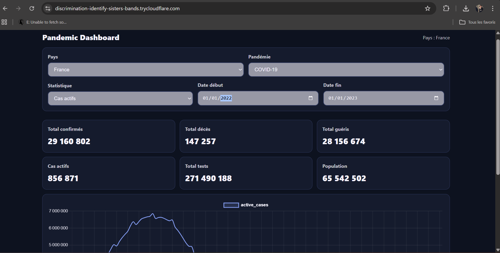
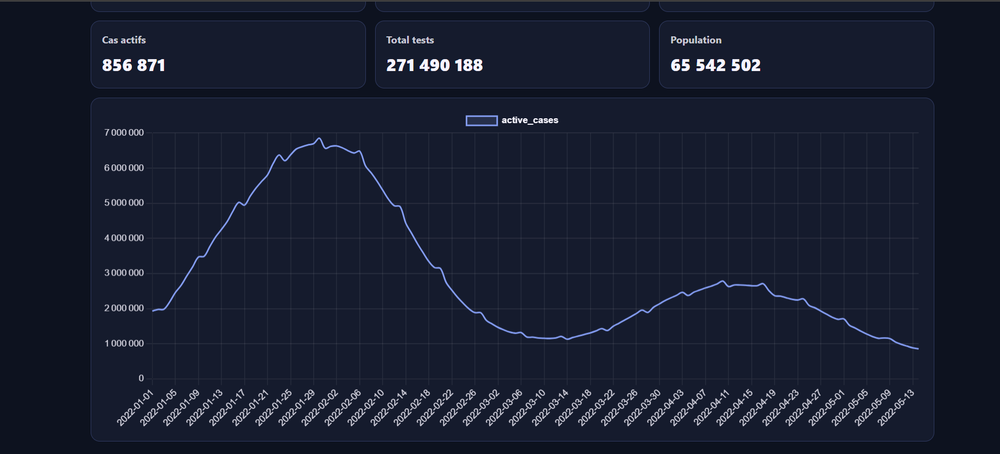
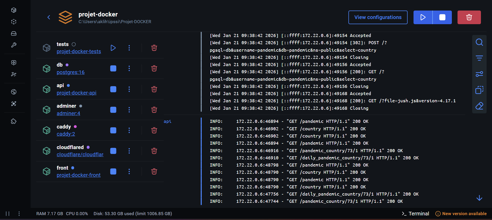
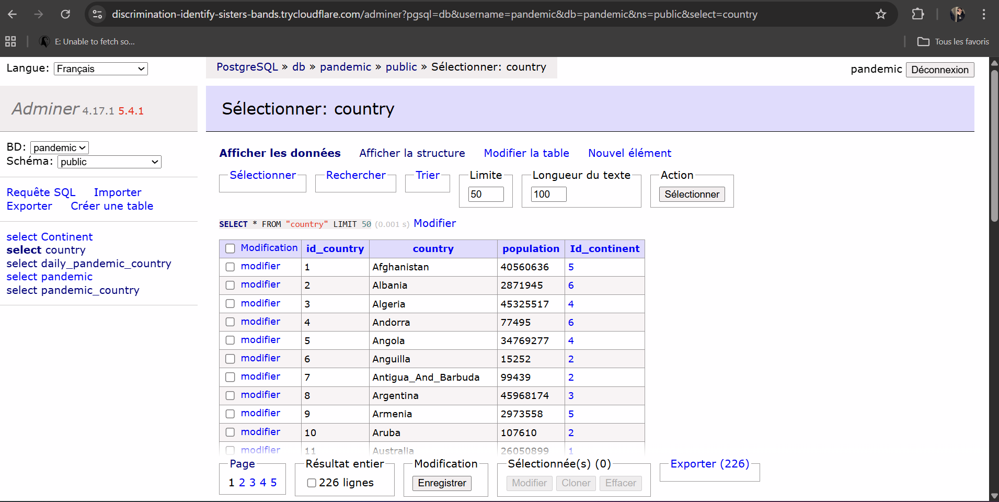
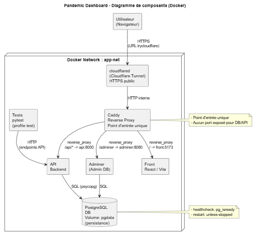

# Pandemic Dashboard 

> - **AKLI Hocine** 

---

## 1. Présentation du Projet

Ce projet déploie une stack **Docker Compose** complète pour consulter des données de pandémie (ex: COVID-19) via un **dashboard web**.
L’application est composée d’un **frontend React/Vite**, d’une **API**, d’une **base PostgreSQL** persistante, d’un service **Adminer** pour gérer la DB, d’un **reverse proxy Caddy** comme point d’entrée unique, et d’un **tunnel Cloudflare (cloudflared)** pour rendre le projet accessible publiquement en HTTPS.


**Fonctionnalités principales :**
- Sélection d’un **pays** et d’une **pandémie**
- Affichage de **statistiques** (KPI) et d’un **graphique** (données quotidiennes)
- **Adminer** pour visualiser / gérer les données PostgreSQL
- **Tests automatisés** de l’API dans un conteneur dédié (pytest)


**Lien accessible (si tunnel actif) :**  

 `https://VOTRE-URL.trycloudflare.com`  
(Le lien est affiché dans les logs du conteneur `cloudflared`)


**Screenshot de l'application déployée** :  










---

## 2. Architecture Technique

### Schéma d'infrastructure (UML)

Ce schéma est généré à partir du fichier `docs/architecture.puml` exporté depuis VS Code (PlantUML).



---


**Points DevOps respectés :**
-  Base PostgreSQL persistée via **volume** (`pgdata`)
-  Pas d’exposition directe des ports **DB/API** 
-  Reverse proxy unique (**Caddy**) + routing
-  Tunnel public HTTPS via **cloudflared**
-  Robustesse : `restart: unless-stopped` + `healthcheck` PostgreSQL
-  Conteneur de tests dédié (profil `test`)

---

## 3. Guide d'installation

### 3.1 Lancer la stack en local

1) Cloner le dépôt :
```bash
git clone https://github.com/VOTRE-USER/VOTRE-REPO.git
cd VOTRE-REPO
```
2) Créer le fichier .env (exemple) :
```
POSTGRES_DB=pandemic
POSTGRES_USER=pandemic
POSTGRES_PASSWORD=pandemic
VITE_API_URL=/api

```
3) Démarrer la stack :
```bash
docker compose up -d --build

```
### 3.2 Démarrer l’accès public HTTPS

Ce projet utilise un Quick Tunnel gratuit (trycloudflare) : l’URL est temporaire et change à chaque redémarrage.

1) Démarrer cloudflared :
```bash
docker docker compose --profile tunnel up -d cloudflared

```
2) Récupérer l’URL publique :
```bash
docker logs pandemic-cloudflared --tail 40

```
3) Accès public :

https://xxxx.trycloudflare.com (Front)

https://xxxx.trycloudflare.com/api/health (API)

https://xxxx.trycloudflare.com/adminer (Adminer)

### 3.3 Lancer les tests

Les tests sont dans un conteneur dédié (profil test).
```bash
docker compose --profile test up --build --abort-on-container-exit

```