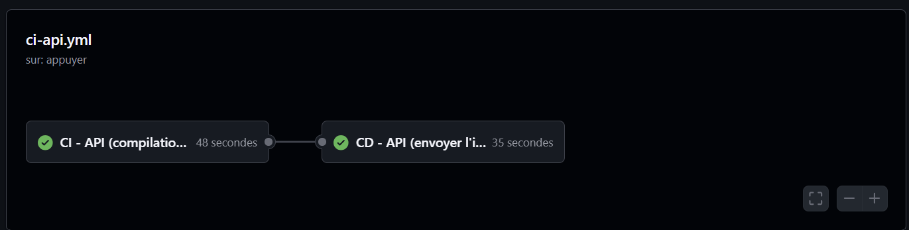
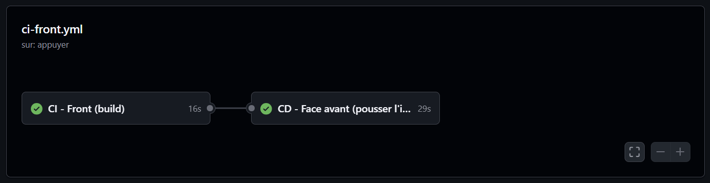

# Pandemic Dashboard 

> - **AKLI Hocine** 

---

## 1. Présentation du Projet

Ce projet déploie une stack **Docker Compose** complète pour consulter des données de pandémie (ex: COVID-19) via un **dashboard web**.

Il est extrait d'un projet IA Data science **OMS** que j'ai fait dans le cadre de prediction ia des prochaines pandemies sur un horizon de 7 jours, ce dernier traite des vraies données nettoyées apres un **ETL COMPLET**.

L’application est composée d’un **frontend React/Vite**, d’une **API**, d’une **base PostgreSQL** persistante, d’un service **Adminer** pour gérer la DB, d’un **reverse proxy Caddy** comme point d’entrée unique, et d’un **tunnel Cloudflare (cloudflared)** pour rendre le projet accessible publiquement en HTTPS.


**Fonctionnalités principales :**
- Sélection d’un **pays** et d’une **pandémie**
- Affichage de **statistiques** (KPI) et d’un **graphique** (données quotidiennes)
- **Adminer** pour visualiser / gérer les données PostgreSQL
- **Tests automatisés** de l’API dans un conteneur dédié (pytest)


**Lien accessible (si tunnel actif) :**  

 `https://VOTRE-URL.trycloudflare.com`  
(Le lien est affiché dans les logs du conteneur `cloudflared`)


**Screenshot de l'application déployée** :  


---

## 2. Architecture Technique

### Schéma d'infrastructure (UML)

Ce schéma est généré à partir du fichier `docs/architecture.puml` exporté depuis VS Code (PlantUML).


---


**Points DevOps respectés :**
-  Base PostgreSQL persistée via **volume** (`pgdata`)
-  Pas d’exposition directe des ports **DB/API** 
-  Reverse proxy unique (**Caddy**) + routing
-  Tunnel public HTTPS via **cloudflared**
-  Robustesse : `restart: unless-stopped` + `healthcheck` PostgreSQL
-  Conteneur de tests dédié (profil `test`)

---
---

## 3. Méthodologie 

J'ai construit le projet  en validant chaque étape avant de passer à la suivante. L’objectif était d’obtenir une stack reproductible et conforme aux contraintes “DevOps”.

### Étapes réalisées

1) **Initialisation de la base PostgreSQL**
- mise en place des fichier ressources `csv`
- Mise en place de PostgreSQL avec volume `pgdata` .
- Ajout des scripts d’initialisation dans `db/init` pour charger automatiquement la base au 1er démarrage.
- Vérification du chargement via des requêtes `SELECT COUNT(*) ...`.

2) **Développement de l’API**
- Mise en place d’une API qui expose les endpoints nécessaires à l’application (listes pays/pandémies, données “summary”, données “daily”).
- Connexion à PostgreSQL via variable d’environnement `DATABASE_URL`.
- Tests manuels curl sur les routes principales.

3) **Développement du Front**
- Création d’un front React/Vite minimal : filtres (pays, pandémie, dates, type de statistique), KPI, graphique.
- Consommation de l’API via `VITE_API_URL`.
- Ajustements UX/CSS 

4) **Mise en place du Reverse Proxy (Caddy)**
- Objectif : un point d’entrée unique.
- Suppression de toute exposition directe des ports DB/API.

5) **Accès public HTTPS (cloudflared)**
- Mise en place d’un tunnel Cloudflare (Quick Tunnel `trycloudflare`) vers Caddy.
- Vérification d’accès public : front + `/api/health` + `/adminer`.

6) **Tests automatisés et fiabilisation**
- Ajout d’un conteneur `tests` (pytest) pour valider automatiquement les endpoints.
- Ajout de `restart: unless-stopped` et `healthcheck` PostgreSQL + `depends_on` pour démarrage propre.

### Outils et organisation
- **Docker / Docker Compose** pour orchestrer les services.
- **Git / GitHub** pour versionner le projet.
- **VS Code + PlantUML** pour le schéma d’architecture.


## 4. Guide d'installation

### 4.1 Lancer la stack en local

1) Cloner le dépôt :
```bash
git clone https://github.com/hocine023/Projet-DOCKER.git
cd Projet-DOCKER
```
2) Créer le fichier .env (exemple) :
```
POSTGRES_DB=pandemic
POSTGRES_USER=pandemic
POSTGRES_PASSWORD=pandemic
VITE_API_URL=/api

```
3) Démarrer la stack :
```bash
docker compose up -d --build

```
### 4.2 Démarrer l’accès public HTTPS

Ce projet utilise un Quick Tunnel gratuit (trycloudflare) : l’URL est temporaire et change à chaque redémarrage.

1) Démarrer cloudflared :
```bash
docker compose --profile tunnel up -d cloudflared

```
2) Récupérer l’URL publique :
```bash
docker logs pandemic-cloudflared --tail 40

```
3) Accès public :

https://xxxx.trycloudflare.com (Front)

https://xxxx.trycloudflare.com/api/health (API)

https://xxxx.trycloudflare.com/adminer (Adminer)

### 4.3 Lancer les tests

Les tests sont dans un conteneur dédié (profil test).
```bash
docker compose --profile test up --build --abort-on-container-exit

```

---

## 5. CI/CD (GitHub Actions)

J'ai mis en place une intégration continue avec GitHub Actions.

### CI 
- **Pipeline API** : build + démarrage DB/API + exécution des tests pytest (conteneur `tests`).
- **Pipeline Front** : build du front.
- Les pipelines sont déclenchés uniquement si les fichiers concernés changent ``paths:``.

### CD 
- Sur un push sur la branche `main`, si la CI passe :
  - build de l’image Docker
  - push de l’image vers GitHub Container Registry
- Cela permet d’avoir des images “prêtes à déployer” automatiquement.

> Remarque : je n'ai pas inclusle déploiement automatique sur un serveur (VM) ici.

### Où voir les pipelines
- Onglet **Actions** du repository GitHub.





---

## 6. Transparence IA 

J’ai utilisé l’IA  comme assistant pour gagner du temps sur des tâches répétitives (structure du docker-compose, exemples de workflows CI/CD, aide au débogage).  
Mais les choix techniques ont été compris, adaptés et validés manuellement.

### Outil utilisé
- ChatGPT 5.2
### Usage concret de l’IA
- Proposition d’architecture (front / api / db / admin / proxy / tunnel / tests), comme le projet orginal OMS que j'ai fait l'annee derniere  etait complexe contenant plusieurs csv et des modeles de prediction ainsi qu'un conteneur grafana et prometheus de supervision j'ai utilise l'ia pour restructurer un front et une api simple et un docker-compose adapter .
- Aide à interpréter des erreurs (ports occupés, Caddyfile invalide, Vite host, etc.).
- Aide à structurer la CI/CD :
J’avais déjà une expérience du CI/CD avec GitLab, mais je n’avais jamais utilisé GitHub Actions.Pour aller plus vite sur la syntaxe et les bonnes pratiques propres à GitHub Actions, j’ai utilisé l’IA comme support, que j’ai adapté à notre stack Docker Compose, remplacé les secrets en clair par GitHub Secrets, et validé la stack tout en observant les logs des runs et en corrigeant les erreurs jusqu’à obtenir une CI/CD stable et compréhensible.

---

## 7. Difficultés rencontrées & solutions (plus complet)

### 7.1 Conflit de ports 
```txt
Bind for 0.0.0.0:80 failed: port is already allocated
listen tcp 0.0.0.0:8080: bind: Only one usage of each socket address is normally permitted.
```
solution: exposer caddy sur un port libre et relancer apres :
```
caddy:
  ports:
    - "8888:80"
```
```bash
docker compose down
docker compose up -d --build
```

## 7.2 Erreur Vite à l’encodage BOM dans package.json
```txt
[SyntaxError] Unexpected token '', "{ ... is not valid JSON
Failed to load PostCSS config
```
Solution: debug avec chatgpt et reformulation du fichier en UTF-8

## 7..3 Caddyfile invalide
```txt
Error: adapting config using caddyfile: /etc/caddy/Caddyfile:2: unrecognized global option: encode
```
commande pour le diagnostic :
```bash
docker logs pandemic-caddy --tail 100
docker exec -it pandemic-caddy sh -lc "sed -n '1,120p' /etc/caddy/Caddyfile"
```
Solution : mettre encode dans le bloc :80 { ... }, puis restart :
```bash
docker compose restart caddy
```

## 7.4 Vite bloqué via Cloudflare Tunnel 
```txt
Blocked request. This host ("xxxx.trycloudflare.com") is not allowed.
To allow this host, add "xxxx.trycloudflare.com" to server.allowedHosts in vite.config.js.
```
Solution : autoriser les hosts côté Vite et rebuild:
```bash
// vite.config.js
export default defineConfig({
  plugins: [react()],
  server: { host: true, port: 5173, allowedHosts: "all" }
});
```
```bash
docker compose up -d --build front
```

## 7.5 Cloudflared : token invalide / tunnel gratuit
```txt
Provided Tunnel token is not valid.
```
Solution : utiliser un Quick Tunnel gratuit trycloudflare sans domaine
```bash
cloudflared:
  image: cloudflare/cloudflared:latest
  command: tunnel --no-autoupdate --url http://caddy:80
  profiles: ["tunnel"]
```
Obtenir l’URL publique :
```bash
docker compose --profile tunnel up -d cloudflared
docker logs pandemic-cloudflared --tail 60
```

## 7.6 Secrets & .env
Problème : .env a été push.

Solution: supprimer et rajout du .gitignore ainsi que l'utilisation de GitHub Secrets (POSTGRES_DB, POSTGRES_USER, POSTGRES_PASSWORD) dans les workflows CI/CD.
```bash
git rm --cached .env
git commit -m "Remove .env from repository"
```